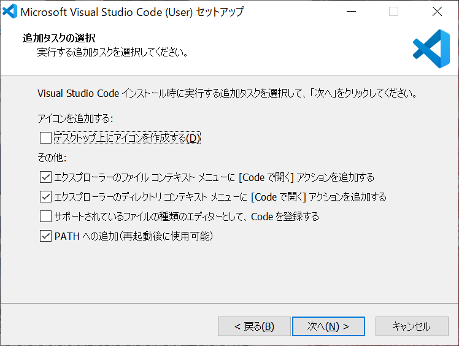
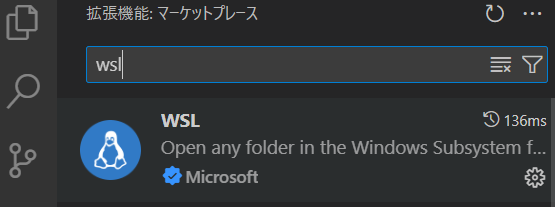
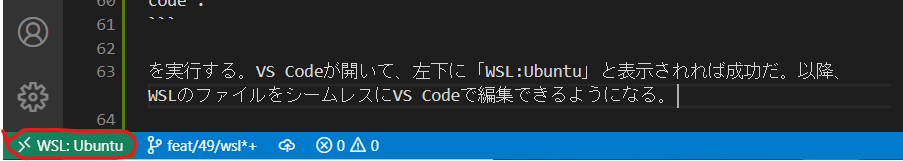
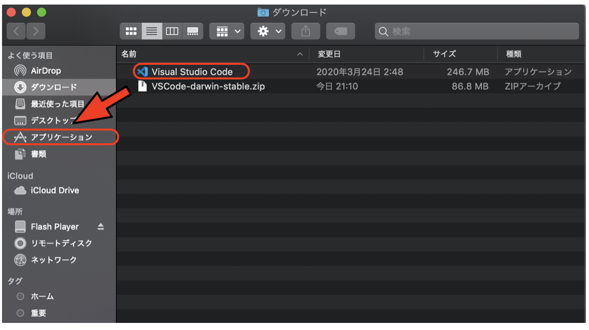

# GitやVS Codeのインストール

## Gitのインストール

WindowsでGitを使うには、WSL (Ubuntu)を使う方法と、Git for Windowsを使う方法がある。

### Windows (Ubuntu)

まずWSLをインストールする。PowerShellを「管理者」として実行し、開いたシェルで以下を実行する。

```sh
wsl --install
```

これでデフォルトでUbuntuがインストールされる。Windowsの検索欄でUbuntuと入力するとUbuntuが起動する。よく使うのでタスクバーにピン止めしておくとよい。ただし、デフォルトではPowerShellが起動してしまうため、「設定」の「スタートアップ」から「既定のプロファイル」をUbuntuにしておくとよい。

Ubuntuが起動したら、

```sh
sudo apt update
sudo apt install git
```

を実行せよ。インストールが完了したら、

```sh
git --version
```

を実行せよ。

```txt
git version 2.43.0
```

等と表示されればインストール完了である(バージョンは異なる場合がある)。

### Windows (Git for Windows)

以下の手順でGit for Windowsをインストールする。

1. Git for Windowsのウェブサイト([https://gitforwindows.org/](https://gitforwindows.org/))にアクセスし、「Download」ボタンをクリックする。
1. ダウンロードした実行ファイル(Git-2.53.0-64-bit.exeのような名前)を実行する。
1. あとは指示に従ってインストールを進める。ほとんどデフォルトのまま「Next」でよいが、途中で「Choosing the default editor used by Git」という箇所でエディタを選ぶ箇所がある。「Vimではないエディタを選ぶことを推奨する」みたいなことが書いてあるが、私はVimのままにしておくことを勧める。
1. 最後に出てくる「Install」ボタンを押すとインストールが始まる。インストールが終わったら「Finish」で完了。

インストール後、Windowsの検索ウィンドウに「git bash」と入力するとGit Bashが表示されるので、それをクリックすることでGit Bashが起動する。

### Mac

Macの場合は、Homebrewからインストールする。ターミナルから

```sh
brew update
brew install git
```

を実行せよ。インストールが完了したら、

```sh
git --version
```

を実行せよ。

```txt
git version 2.53.0
```

と表示されればインストール完了である(バージョンは異なる場合がある)。

## VSCodeのインストール

Visual Studio Code、通称VSCodeは、Microsoftが中心となって開発を進めているオープンソースのエディタである。Windows/Mac/Linuxで動作するクロスプラットフォームであり、豊富なプラグインがあるためにユーザが増えている。以下ではVSCodeのインストールと、VSCodeからPythonを実行する環境まで構築する。なお、自分の好きな開発環境があるならそれを使ってよい。

### Windows

#### ダウンロードとインストール

[https://code.visualstudio.com/](https://code.visualstudio.com/)に行って、「Download for Windows Stable Build」をダウンロード、インストールする。

途中で「追加タスクの選択」が現れたら、「ファイルコンテキストメニュー」と「ディレクトリコンテキストメニュー」に「「Codeで開く」アクションを追加する」がチェックされていることを確認し、もしされていなかったらチェックしておく。



「デスクトップ上にアイコンを作成する」は、どちらでもかまわない。

#### WSLとの連携

Windowsマシンでは、原則としてWindows Subsystem for Linux (WSL)上で作業を行う。VSCodeは、WindowsでもWSL上でもシームレスに利用できるが、そのためにプラグインを入れておく必要がある。

VSCodeの左のメニューからExtensionsのアイコン(ブロックのマーク)をクリックし、現れた検索窓に「wsl」と入力するとMicrosoftによるWSL拡張「WSL」が表示されるので、「Install」をクリックする。



これをインストールした状態で、WSLのターミナルから適当なディレクトリで

```sh
code .
```

を実行する。VS Codeが開いて、左下に「WSL:Ubuntu」と表示されれば成功だ。



以降、WSLのファイルをシームレスにVS Codeで編集できるようになる。

### Mac

[https://code.visualstudio.com/](https://code.visualstudio.com/)に行って、「Download for Mac Stable Build」をダウンロード、インストールする。

ダウンロードフォルダに「VSCode-darwin-stable.zip」がダウンロードされるので、クリックして解凍する。解凍されてできた「Visual Studio Code」を、アプリケーションフォルダに移動する。例えば「ダウンロード」を「Finderで開く」を選び、「Visual Studio Code」を「アプリケーション」にドラッグする。



VSCodeを起動する。「アプリケーション」から「Visual Studio Code」を起動する。今後よく使うので、Dockに追加しておこう。
