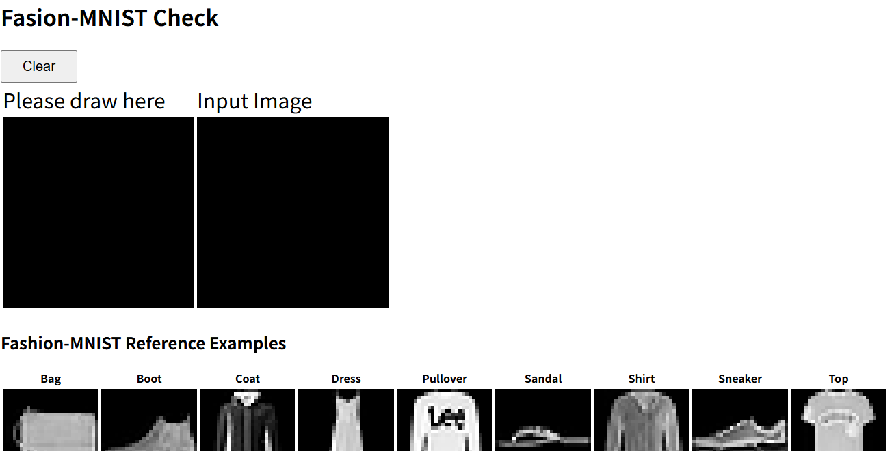
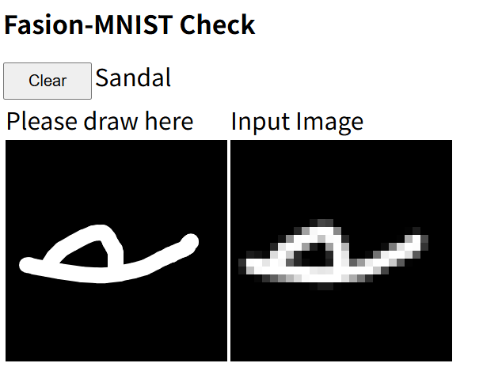

# 機械学習とウェブへのデプロイ

## 目標

* ローカルで機械学習を行い、学習済みの重みをウェブアプリケーション向けに変換する
* 変換した重みを使ってウェブアプリケーションの動作確認を行う
* デプロイする

## 課題1: Fashion-MNISTの学習とデプロイ

MNISTは有名な手書き数字のデータセットだが、数字ではちょっと面白くない。数字の代わりに服やカバン、靴などを認識するデータセット Fashion-MNISTを試してみよう。また、前回はすでに学習済み、ウェブ用に変換済みのデータを使ってデプロイだけを体験したが、今回はPythonによる学習からデータの変換、ウェブへのデプロイまですべて行ってみよう。

### Step 1: リポジトリのfork

GitHubにログインした状態で、以下のサイトにアクセスせよ。

[https://github.com/cpss2026-git/fashion-mnist-demo](https://github.com/cpss2026-git/fashion-mnist-demo)

このサイトの右上に「Fork」というボタンがあるので、それを押す。すると「Create a new fork」という画面になるので設定はデフォルトのまま「Create Fork」ボタンを押す。すると、`fashion-mnist-demo`がforkされ、自分のアカウントのリポジトリとしてコピーされる。

### Step 2: リポジトリのクローン

GitHubの自分のアカウントの`fashion-mnist-demo`をクローンしよう。[https://github.com/](https://github.com/)を開き、Repositoriesから「fashion-mnist-demo」を選ぶ。「Code」ボタンの「Clone」から、リモートリポジトリのURLをコピーしよう。その後、ターミナルで以下を実行することでリポジトリをクローンせよ。

```sh
cd
cd github
git clone git@github.com:アカウント名/fashion-mnist-demo.git
cd fashion-mnist-demo
```

### Step 3: 仮想環境の構築

仮想環境を構築する。このとき、Pythonのバージョンとして3.11以上が必要となる。もし環境のPythonのバージョンが古い場合は、pyenvなどで新しいバージョンをインストールすること。

ターミナルで以下を実行せよ。

```sh
python3 -m venv .venv
source .venv/bin/activate
python3 -m pip install --upgrade pip
python3 -m pip install tensorflow tensorflowjs
```

Macの場合は、python3.11を使って仮想環境を作ってもよい(pyenvを使ってもよい)。

```sh
python3.11 -m venv .venv
source .venv/bin/activate
python3 -m pip install --upgrade pip
python3 -m pip install tensorflow tensorflowjs
```

仮想環境をアクティベート後は、`python3`を指定すればよい。

### Step 4: 訓練

データセットの読み込みとモデルの学習をさせてみよう。以下を実行せよ。

```sh
python3 train.py
```

実行後、以下のような出力がされたら実行に成功している。なお、数字の詳細は環境によって異なる。

```txt
Epoch 1/5
1875/1875 ━━━━━━━━━━━━━━━━━━━━ 3s 1ms/step - accuracy: 0.8266 - loss: 0.4958    Epoch 2/5
1875/1875 ━━━━━━━━━━━━━━━━━━━━ 2s 1ms/step - accuracy: 0.8658 - loss: 0.3749  
Epoch 3/5
1875/1875 ━━━━━━━━━━━━━━━━━━━━ 2s 1ms/step - accuracy: 0.8769 - loss: 0.3376  
Epoch 4/5
1875/1875 ━━━━━━━━━━━━━━━━━━━━ 2s 1ms/step - accuracy: 0.8852 - loss: 0.3126  
Epoch 5/5
1875/1875 ━━━━━━━━━━━━━━━━━━━━ 2s 1ms/step - accuracy: 0.8916 - loss: 0.2939  
313/313 ━━━━━━━━━━━━━━━━━━━━ 0s 878us/step - accuracy: 0.8716 - loss: 0.3586

Test accuracy: 0.8715999722480774

Model was saved.
```

コード実行後、`model.keras`というファイルが作成されている。これが学習済みモデルを保存したファイルである。

### Step 5: 学習テスト

正しく学習できたか確認してみよう。以下を実行せよ。

```sh
python3 check.py
```

これは、学習に使っていない100個のデータについて、学習済みモデルに分類させ、正解か不正解かチェックを行って、何個正解したかを表示するものだ。例えば、以下のような結果が出力される。

```txt
0: true=Boot     pred=Boot     Correct
1: true=Pullover pred=Pullover Correct
2: true=Trouser  pred=Trouser  Correct
(snip)
98: true=Coat     pred=Coat     Correct
99: true=Pullover pred=Pullover Correct

Accuracy: 86/100 = 86.00%
```

この例では、100個中86個正解、すなわち正解率86%であった。

### Step 6: 変換

Pythonで学習したモデル`model.keras`を、JavaScript (正確にはTensorFlowJS)向けに変換しよう。まず、モデルの内容をエクスポートする。以下を実行せよ。

```sh
python3 export.py
```

これにより、`model.keras`から、`export`ディレクトリが作成される。

さらに、このディレクトリからJSONを作成する。以下を実行せよ。

```sh
tensorflowjs_converter export docs/model
```

これにより、`export`ディレクトリの内容から、`docs/model`に`model.json`と`group1-shard1of1.bin`が作成される。

なお、setuptoolsのバージョンによっては、以下のようなエラーが起きる場合がある。

```txt
Traceback (most recent call last):
  File "/home/watanabe/github/fashion-mnist-demo/.venv/bin/tensorflowjs_converter", line 3, in <module>
    from tensorflowjs.converters.converter import pip_main
  File "/home/watanabe/github/fashion-mnist-demo/.venv/lib/python3.12/site-packages/tensorflowjs/__init__.py", line 21, in <module>
    from tensorflowjs import converters
  File "/home/watanabe/github/fashion-mnist-demo/.venv/lib/python3.12/site-packages/tensorflowjs/converters/__init__.py", line 21, in <module>
    from tensorflowjs.converters.converter import convert
  File "/home/watanabe/github/fashion-mnist-demo/.venv/lib/python3.12/site-packages/tensorflowjs/converters/converter.py", line 38, in <module>
    from tensorflowjs.converters import tf_saved_model_conversion_v2
  File "/home/watanabe/github/fashion-mnist-demo/.venv/lib/python3.12/site-packages/tensorflowjs/converters/tf_saved_model_conversion_v2.py", line 51, in <module>
    import tensorflow_hub as hub
  File "/home/watanabe/github/fashion-mnist-demo/.venv/lib/python3.12/site-packages/tensorflow_hub/__init__.py", line 85, in <module>
    _ensure_tf_install()
  File "/home/watanabe/github/fashion-mnist-demo/.venv/lib/python3.12/site-packages/tensorflow_hub/__init__.py", line 61, in _ensure_tf_install
    from pkg_resources import parse_version
ModuleNotFoundError: No module named 'pkg_resources'
```

これは、setuptoolsのバージョンが新しすぎることが原因なので、setuptoolsを一度アンインストールし、バージョン80.9.0をインストールすればよい。

```sh
python3 -m pip uninstall setuptools
python3 -m pip install "setuptools==80.9.0"
```

その後、もう一度`tensorflowjs_converter`を実行すればよい。

### Step 7: VS Codeの起動

VS Codeの「フォルダーを開く」から`~/github/fashion-mnist-demo`を開く。その後、VS Codeで`docs/index.html`を表示している状態で、右下の「Go Live」をクリックして、Live Serverを立ち上げる。以下のような画面が表示されるはずである。



このうち、左の「Please Draw here」にマウスで絵が描ける。それを28x28ピクセルにしたものが右の「Input Image」であり、これがモデルに入力される。

何か絵を描くと、モデルがそれを何であるかを判断する。



例えば、上記は、サンダルと判断されている。

画面の下に、各クラス10個ずつデータセットのサンプルがあるので、すべてのクラスが表示されるように試してみるとよいだろう。

終わったらLive Serverを終了する。VS Codeの右下の「Go Live」があったところに「Port: 5500」とあるので、そこをクリックする。

### Step 8: 学習済みモデルの追加

先ほど学習したモデルの変換後の重みをGit管理しよう。以下を実行せよ。

```sh
git add docs/model
git commit -m "adds model"
git push
```

### Step 9: Pagesの設定

先ほどと同様な手順で、GitHub Pagesを公開しよう。GitHubの自身の`fashion-mnist-demo`リポジトリを開いてから、以下を実行せよ。

* 上のタブの「Settings」を選ぶ。
* 左のメニューから「Pages」を選ぶ。
* 「GitHub Pages」という画面になるので、「Source」は「Deploy from a branch」のまま、「Branch」が「None」となっているのでボタンをクリックし、`main`を選ぶ。
* 「`/root`」というボタンが現れるので、クリックして「`/docs`」を選んで「Save」ボタンを押す。

そのまま数分待ってから、その画面をリロードしよう。

準備ができていれば

```txt
Your site is live at https://ユーザ名.github.io/fashion-mnist-demo/
```

という表示がされる。表示されたら、その表示の右にある「Visit site」ボタンを押すこと。Fashion MNISTの分類テストデモがブラウザで実行されるはずである。
